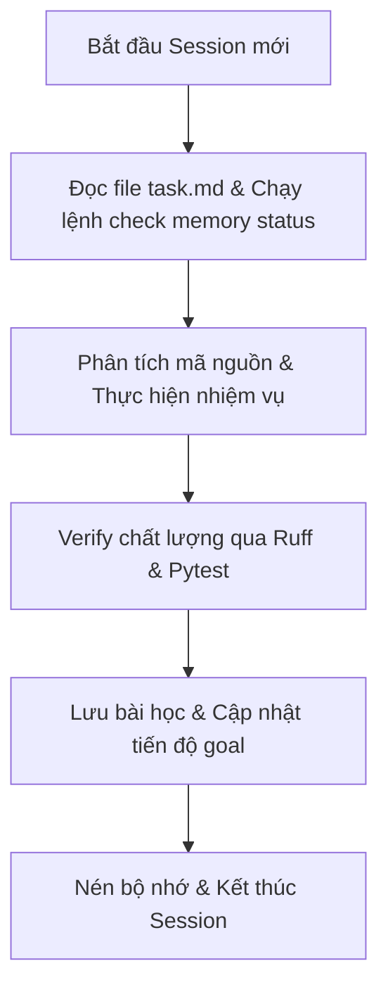

# CẨM NANG HƯỚNG DẪN SỬ DỤNG PROJECT TEMPLATE
## Portable Python & Antigravity 2.0+ Workflow

Tài liệu này cung cấp hướng dẫn chi tiết về cấu trúc, cách thiết lập, vận hành hệ thống Agent/Sub-agent và quản lý bộ nhớ chia sẻ nhằm tối ưu hóa chi phí token và đảm bảo tính liên tục của ngữ cảnh khi chuyển đổi giữa các tài khoản AI hoặc các công cụ Agent khác nhau (Gemini, Claude, Codex).

---

## 🎯 1. Triết Lý Thiết Kế & Cấu Trúc Hệ Thống

Template này được xây dựng dựa trên sự kết hợp giữa **Triết lý Andrej Karpathy (Vibe Coding/First-Principles)** và **Triết lý Kaizen (Cải tiến liên tục/Poka-Yoke)**:

*   **Đơn giản là tối thượng (YAGNI):** Code tối giản, không viết dư thừa hay dự đoán tương lai.
*   **Poka-Yoke (Chống sai lỗi):** Ràng buộc hệ thống chặt chẽ qua Type Hints, Linter (`ruff`), và kiểm thử tự động (`pytest`).
*   **Persistent Shared Memory:** Bộ nhớ cục bộ độc lập với nền tảng AI giúp chuyển giao phiên làm việc (Session) mượt mà mà không mất ngữ cảnh hay lãng phí token load lại codebase.

### Cấu Trúc Thư Mục Chi Tiết
```
├── .agent/                  # Thư mục cấu hình cốt lõi của Agent
│   ├── memory/              # Lưu trữ dữ liệu bộ nhớ dùng chung
│   │   ├── state.json       # Trạng thái mục tiêu, tiến độ, sơ đồ file quan trọng
│   │   └── lessons.json     # Các bài học kinh nghiệm, lỗi cần tránh
│   ├── rules/               # Bộ quy tắc hành vi bắt buộc của Agent
│   ├── scripts/             # Công cụ bổ trợ (CLI memory_tool.py)
│   ├── skills/              # Kỹ năng cục bộ đã tối ưu (debugging, auditing...)
│   └── subagents/           # Prompt mẫu tối giản cho các Sub-agent chuyên biệt
├── docs/                    # Thư mục tài liệu hướng dẫn sử dụng
│   └── user_guide.md        # Tài liệu hướng dẫn sử dụng dự án
├── src/                     # Mã nguồn chính của dự án (Python 3.11+)
├── tests/                   # Bộ unit test sử dụng Pytest
├── clean.bat                # Script dọn dẹp file rác nhanh (.pyc, cache)
├── bootstrap.bat            # Bootstrapper cài đặt tự động trên Command Prompt
├── bootstrap.ps1            # Bootstrapper cài đặt tự động trên PowerShell
├── update.bat               # Script cập nhật thư viện dự án tự động
└── pyproject.toml           # Cấu hình chuẩn hóa cho Ruff và Pytest
```

---

## 🚀 2. Thiết Lập Ban Đầu (Basic Setup)

Hệ thống sử dụng bộ quản lý gói cực nhanh `uv` của Astral để dựng môi trường Python cô lập ngay bên trong dự án (`.venv`) mà không ảnh hưởng tới hệ thống toàn cục.

### Bước 1: Cài đặt công cụ uv trên Windows
Mở PowerShell dưới quyền Admin và chạy lệnh:
```powershell
winget install astral-sh.uv
```

### Bước 2: Khởi tạo môi trường tự động
Bạn có thể thiết lập nhanh theo 2 cách:
*   **Cách 1: Chạy file Batch tương tác (.bat)**
    Nhấp đúp chuột vào `bootstrap.bat` hoặc chạy từ terminal. Tệp sẽ hiển thị menu cho phép lựa chọn phiên bản Python mong muốn (mặc định khuyến nghị 3.11 hoặc 3.12).
*   **Cách 2: Chạy qua PowerShell (.ps1)**
    ```powershell
    .\bootstrap.ps1 -PythonVersion "3.11"
    ```

> [!NOTE]
> Quá trình cài đặt sẽ tự động:
> 1. Tạo môi trường ảo `.venv` cục bộ.
> 2. Cài đặt các thư viện trong `requirements.txt`.
> 3. Tạo file cấu hình môi trường `.env` từ `.env.example`.
> 4. Chạy kiểm tra cú pháp (`ruff check`) và unit test mẫu.
> 5. Cấu hình Git Pre-commit Hook để tự động kiểm tra code trước mỗi lần commit.

---

## 🤖 3. Làm Việc Với Các Agent (Single Agent Workflow)

Mỗi khi bạn bắt đầu một phiên làm việc với một Agent mới (hoặc tài khoản AI mới), quy trình hoạt động luôn phải tuân theo vòng lặp **Onboarding -> Execution -> Handover**.



### Quy Trình Onboarding Đầu Phiên (Bắt Buộc)
Khi một Agent mới tham gia dự án, Agent đó **PHẢI** thực hiện:
1.  Đọc tệp `AGENTS.md` tại thư mục gốc để nắm rõ các giao thức hoạt động.
2.  Đọc tệp `task.md` để nắm danh sách công việc hiện tại.
3.  Kiểm tra trạng thái bộ nhớ cục bộ bằng lệnh:
    ```powershell
    uv run python .agent/scripts/memory_tool.py status
    ```

---

## 👥 4. Làm Việc Với Multi Sub-Agents

Khi dự án lớn dần, việc phân rã nhiệm vụ và chạy song song (Parallel execution) thông qua Sub-agents sẽ giúp tối ưu hóa hiệu quả công việc.

### Khi nào nên dùng Sub-agent?
*   **Nên dùng:** Khi nhiệm vụ có thể phân rã thành các phần độc lập (Ví dụ: thiết kế API Backend ở một góc, xây dựng UI Frontend ở một góc khác, viết tài liệu/E2E test ở một góc khác).
*   **Không nên dùng:** Cho các tác vụ tuần tự, đơn giản hoặc sửa lỗi nhỏ. Việc chuyển ngữ cảnh giữa các sub-agent sẽ tốn tài nguyên và dễ gây xung đột code.

### Lựa chọn Workspace Mode phù hợp
Khi khởi tạo Sub-agent (`invoke_subagent`), bạn phải chỉ định `Workspace` mode:
1.  `inherit` (Mặc định): Sub-agent làm việc chung thư mục hiện tại. Phù hợp khi cần nhờ trợ giúp nhanh hoặc đọc thông tin.
2.  `share`: Chia sẻ thư mục gốc nhưng hoạt động độc lập (tương tự git worktree). Sử dụng khi các Sub-agent cùng tham gia lập trình trực tiếp vào dự án.
3.  `branch`: Tạo thư mục cô lập hoàn toàn từ nhánh chính. Dùng cho việc thử nghiệm các ý tưởng mới (spikes), nghiên cứu thư viện lạ, tránh làm xáo trộn mã nguồn chính.

### Các loại Sub-agent chuyên biệt sẵn có
Hệ thống chuẩn bị sẵn 18 cấu trúc prompt chuyên dụng trong `.agent/subagents/`:
*   `coder`: Lập trình logic, tích hợp đầy đủ bộ kỹ năng Python Pro.
*   `linter`: Dọn dẹp định dạng và giải quyết các cảnh báo mã nguồn bằng `Ruff`.
*   `tester`: Chạy test suite và phân tích lỗi kiểm thử bằng `pytest`.
*   `planner`: Lên checklist nhiệm vụ và brainstorm thiết kế hệ thống.
*   `designer`: Thiết kế giao diện nghệ thuật, UI/UX, và canvas.
*   `frontend`: Phát triển giao diện người dùng, cấu hình tối ưu web.
*   `backend`: Xây dựng logic API và kết nối cơ sở dữ liệu an toàn.
*   `writer`: Tạo nội dung copywriting, viết cẩm nang và SEO content.
*   `debugger`: Điều tra nguyên nhân gốc rễ của lỗi logic một cách khoa học.
*   `auditor`: Kiểm tra và đánh giá thiết kế bảo mật cho dự án.
*   `refactorer`: Đơn giản hóa cấu trúc code phức tạp.
*   `git_manager`: Quản lý quy trình commit và đẩy mã nguồn.
*   `coordinator`: Điều phối tài nguyên, tránh xung đột ghi tệp giữa các subagent.
*   `llm_app_developer`: Quản lý cửa sổ ngữ cảnh, RAG và Prompt Caching.
*   `agent_architect`: Thiết kế đồ thị trạng thái Agent nâng cao (LangGraph) và MCP tools.
*   `security_engineer`: Quét lỗ hổng, thực hiện kiểm thử xâm nhập (Ethical Hacking).
*   `security_developer`: Viết mã phòng thủ an toàn (MFA, rate-limit, PCI DSS).
*   `marketing_growth`: Triển khai A/B test và tích hợp tracking Analytics.

---

## 💾 5. Quản Lý Bộ Nhớ Dự Án & Độc Lập Tài Khoản (Shared Memory)

Bộ nhớ cục bộ được tổ chức trong thư mục `.agent/memory/` dưới dạng file JSON. Khi bạn chuyển tài khoản AI (ví dụ: chuyển từ Account A sang Account B để reset rate limit) hoặc đổi từ Gemini sang Claude, **bộ nhớ này đóng vai trò cầu nối thông tin.**

### Các tệp bộ nhớ
1.  `state.json`: Lưu trữ thông tin mục tiêu hiện tại (`current_goal`), tiến độ (%) và các mốc quan trọng (`milestones`).
2.  `lessons.json`: Lưu trữ các bài học xương máu rút ra trong quá trình phát triển (lỗi cú pháp đặc thù, cách sửa lỗi thiết lập môi trường...).

### Tương tác với bộ nhớ qua CLI `memory_tool.py`

*   **Xem trạng thái hiện tại:**
    ```powershell
    uv run python .agent/scripts/memory_tool.py status
    ```
*   **Thiết lập mục tiêu mới:**
    ```powershell
    uv run python .agent/scripts/memory_tool.py set-goal "Tên mục tiêu" -d "Mô tả chi tiết mục tiêu" --progress 0
    ```
*   **Cập nhật tiến độ & hoàn thành cột mốc:**
    ```powershell
    uv run python .agent/scripts/memory_tool.py update-goal --progress 75 --status in_progress --milestone "Xây dựng xong API đăng nhập"
    ```
*   **Tự động cập nhật tệp tin đã sửa đổi (Git Sync):**
    ```powershell
    uv run python .agent/scripts/memory_tool.py sync-git
    ```
*   **Lưu lại bài học kinh nghiệm:**

    ```powershell
    uv run python .agent/scripts/memory_tool.py add-lesson "Lỗi mã hóa UTF-8 trên Windows" "Ruff báo lỗi encode vì Windows mặc định cp1252. Luôn mở file với encoding='utf-8'." --tags "windows,encoding,ruff"
    ```
*   **Tìm kiếm bài học cũ:**
    ```powershell
    uv run python .agent/scripts/memory_tool.py search "windows"
    ```

### ⚠️ Cơ chế nén bộ nhớ (Token Optimization)
Bộ nhớ lưu trữ quá lớn sẽ làm phình to context window và tốn chi phí. Hãy yêu cầu Agent chạy lệnh sau trước khi kết thúc phiên để nén các file JSON thành một dòng duy nhất (minify):
```powershell
uv run python .agent/scripts/memory_tool.py compress
```
*(Đồng thời, định kỳ xóa các mục tiêu đã hoàn thành cũ trong `state.json` để giữ dung lượng tệp dưới 20KB).*

---

## ⚠️ 6. Các Vấn Đề Quan Trọng Cần Lưu Ý

Khi làm việc trên môi trường Windows với Python 3.11+, luôn ghi nhớ các nguyên tắc kỹ thuật sau:

### 1. Đường dẫn tệp trên Windows
*   Trong mã nguồn Python, luôn sử dụng thư viện `pathlib.Path` hoặc viết chuỗi raw (ví dụ: `r"C:\Users\..."`) để tránh lỗi thoát ký tự đường dẫn (`\U`, `\n`).
*   Trong các tệp cấu hình JSON hoặc Markdown link, **luôn dùng dấu gạch chéo xuôi (`/`)**. Hệ thống Windows hiện đại và Python API đều hiểu định dạng này.

### 2. Định dạng mã hóa UTF-8
*   Mặc định, Windows có thể đọc file bằng bảng mã nội địa (`cp1252`). Điều này gây ra lỗi nghiêm trọng khi biên dịch hoặc phân tích cú pháp.
*   **Quy tắc bắt buộc:** Luôn mở/ghi file với bảng mã UTF-8:
    ```python
    with open("file.txt", "r", encoding="utf-8") as f:
        content = f.read()
    ```

### 3. Vận hành môi trường ảo cục bộ
*   Không bao giờ chạy trực tiếp `python` hay `pytest` từ môi trường global.
*   Luôn chạy các lệnh qua `uv run` (ví dụ: `uv run pytest`, `uv run ruff check .`) để đảm bảo các package được nạp chính xác từ thư mục `.venv` cục bộ.

---

## 📋 Checklist Kết Thúc Phiên Làm Việc (Handover Checklist)

Trước khi tắt chat hoặc đổi tài khoản Agent khác, hãy thực hiện:
- [ ] Chạy `uv run pytest` để chắc chắn code không bị lỗi logic.
- [ ] Chạy `uv run ruff check --fix` để định dạng lại code sạch sẽ.
- [ ] Cập nhật tiến trình công việc trong `task.md`.
- [ ] Chạy lệnh `update-goal` và `add-lesson` để lưu trạng thái vào bộ nhớ cục bộ.
- [ ] Chạy `compress` để tối ưu dung lượng bộ nhớ.
- [ ] Đẩy code lên Git remote (nếu có cấu hình).

---

## 🛡️ 7. Bảo Mật Hệ Thống & Chống Xóa Nhầm (Security Guardrails)

Hệ thống tích hợp quy tắc bảo mật bất biến (**IMMUTABLE SECURITY GUARDRAIL**) được cấu hình trong `AGENTS.md` và `.agent/rules/07-security-guardrails.md`:

1.  **Context Boundary (Ranh giới Ngữ cảnh):** Agent tuyệt đối không được phép thao tác tệp tin hoặc terminal bên ngoài thư mục gốc của dự án. Không quét hoặc đọc các thư mục nhạy cảm của hệ thống (`C:/Windows`, `/etc/`, v.v.).
2.  **Command Blacklist (Danh sách Lệnh Cấm):** Cấm tuyệt đối các lệnh hủy diệt như `rm -rf /`, `rd /s /q c:\`, `del` càn quét mở rộng, `Remove-Item` càn quét sâu hoặc các lệnh can thiệp sâu vào ổ đĩa như `format`, `diskpart`.
3.  **Safe Deletion Protocol (Quy trình Xóa An toàn):**
    *   Trước khi xóa tệp, Agent phải chạy `git status` hoặc kiểm tra danh sách file để xác nhận.
    *   Chỉ được phép xóa trong các thư mục cache tạm thời (`__pycache__/`, `.pytest_cache/`, `.ruff_cache/`) hoặc các tệp được thêm trực tiếp bởi nhiệm vụ active hiện tại.
4.  **Security Interceptor (Đánh chặn Vi phạm):** Nếu phát hiện subagent hoặc kế hoạch thực thi cố tình vi phạm ranh giới bảo mật, Agent chính sẽ lập tức dừng vòng lặp điều phối, ghi nhận payload vi phạm vào tệp `AUDIT_LOG.md` và trả lại quyền kiểm soát cho người dùng.

---

## 🛠️ 8. Memory Harness Pro Upgrade (Bản thử nghiệm nâng cao)

Trên nhánh `feature/memory-harness-upgrade`, dự án đã được tích hợp thử nghiệm 5 giải pháp tối ưu hóa bộ nhớ chuyên sâu:
*   **State Graph (Đồ thị Trạng thái):** Ghi chép tiến độ nhiệm vụ dạng nút cha-con.
*   **BM25 Search (Bộ máy tìm kiếm BM25):** Truy xuất bài học kinh nghiệm chính xác cao bằng xếp hạng toán học thay vì regex đơn giản.
*   **File-Delta Line-Stat:** Thu thập chi tiết số dòng thêm/xóa qua Git Diff.
*   **Context Compaction:** Tự động giám sát giới hạn token và gợi ý nén.
*   **Orphan Branch Sync:** Cơ chế chạy ngầm đồng bộ bộ nhớ lên nhánh Git ẩn.

### Hướng dẫn kiểm thử nâng cấp bộ nhớ:
*   Chạy benchmark: `uv run python .agent/scripts/test_memory_upgrade.py`
*   Chạy kiểm thử: `uv run pytest tests/test_memory_harness.py`
*   Xem hướng dẫn chi tiết tiếng Việt tại: [huong_dan_memory_upgrade.md](file:///C:/Users/firef/Documents/antigravity/joyful-babbage/docs/huong_dan_memory_upgrade.md)


